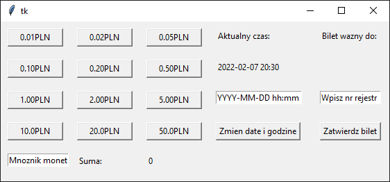
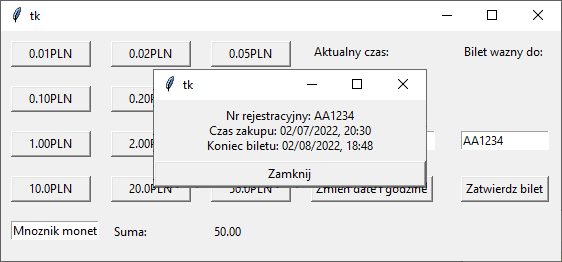

# 2. Parking meter

## Task description

- The parking meter stores information about the coins/banknotes in it
in it (1, 2, 5, 10, 20, 50gr, 1, 2.5, 10, 20, 50 PLN)
- A window with a text field for the vehicle registration number, the current date (year, month, day, hour, minute), the date of departure from the parking lot (year, month, day, hour, minute), buttons for inserting coins (please include a field allowing enter the number of coins inserted), and click the "Confirm" button.
- The program should contain a field that allows you to change the current time.
- Parking zone rules:
- The paid parking zone is valid from 8 a.m. to 8 p.m., Monday to Friday.
- The first hour is paid PLN 2.
- The second hour is paid PLN 4.
- The third and subsequent hours are paid PLN 5 each.
- Time exceeding the paid parking period is transferred to the next day
- Purchasing a parking hour at 7:20 p.m. on Friday allows you to park until 8:20 a.m. on Monday (ends at 8:20 p.m., goes 20 minutes beyond paid parking, moves to the next paid parking day).
- After each coin insertion, the departure date is updated according to the entire inserted amount.
- If less money is deposited than is needed to pay for a full hour, then only a partial hour is paid:
- Paying PLN 1 allows you to park for 30 minutes,
- Inserting PLN 5 allows you to park for 1 hour and 45 minutes (PLN 2 to pay for the first hour, PLN 3 remains, and you need PLN 4 to pay for the next hour, which gives 3/4 hour: 45 minutes).
- After pressing the "Confirm" button, a window is displayed confirming payment for the parking lot: vehicle registration number, purchase time and departure date.
- The registration number can only consist of capital letters from A to Z and numbers.
- The machine can hold any number of banknotes (PLN 10, 20, 50) and 200 coins of each type. Attempting to insert a coin over the limit results in displaying information that the parking meter is overflowing and asking you to insert a different denomination.

## Tests

1. Set the incorrect time. Expected error message. Set the time to 12:34.
2. Add PLN 2, expected departure date one hour after the current time. Add PLN 4, expected departure time two hours after the current time. Add PLN 5, expected departure time three hours after the current time. Add another PLN 5, the expected departure date is four hours after the current time.
3. Insert enough money so that the departure date is transferred to the next day, according to the rules - insert enough coins so that the departure date is after 7 p.m., add a PLN 5 coin,
4. Insert enough money so that the departure date is transferred to the next week, according to the rules - insert enough coins so that the departure date is Friday after 7 p.m., and then add a PLN 5 coin,
5. Insert PLN 1, expected departure date half an hour after the current time,
6. Insert 200 1gr coins, the expected departure date is one hour after the current time.
7. Insert 201 1gr coins, expect information that the parking meter is overflowing.
8. Pressing "Confirm" without inserting coins -- expected error information.
9. Pressing "Confirm" without entering the registration number - expected error information. Pressing "Confirm" after entering an incorrect registration number - expected error information.
